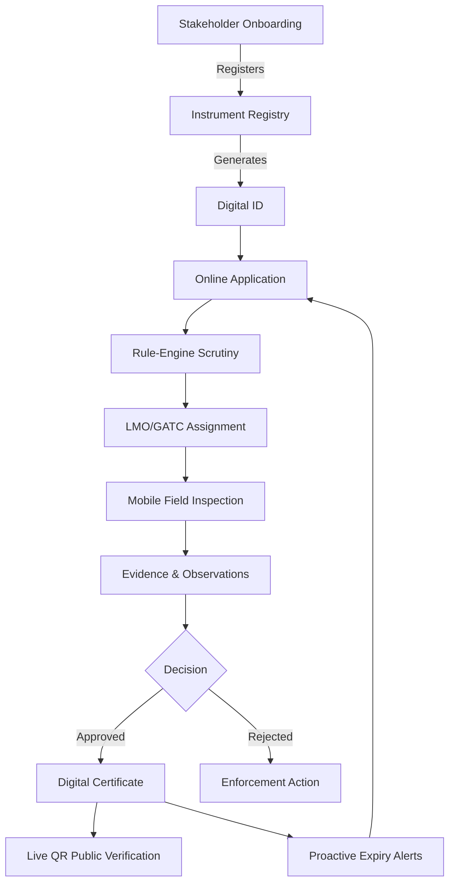

# 01-lifecycle-workflow

```mermaid
graph TD
    A[Stakeholder Onboarding] -->|Registers| B[Instrument Registry]
    B -->|Generates| C[Digital ID]
    C --> D[Online Application]
    D --> E[Rule-Engine Scrutiny]
    E --> F[LMO/GATC Assignment]
    F --> G[Mobile Field Inspection]
    G --> H[Evidence & Observations]
    H --> I{Decision}
    I -->|Approved| J[Digital Certificate]
    I -->|Rejected| K[Enforcement Action]
    J --> L[Live QR Public Verification]
    J --> M[Proactive Expiry Alerts]
    M --> D
```